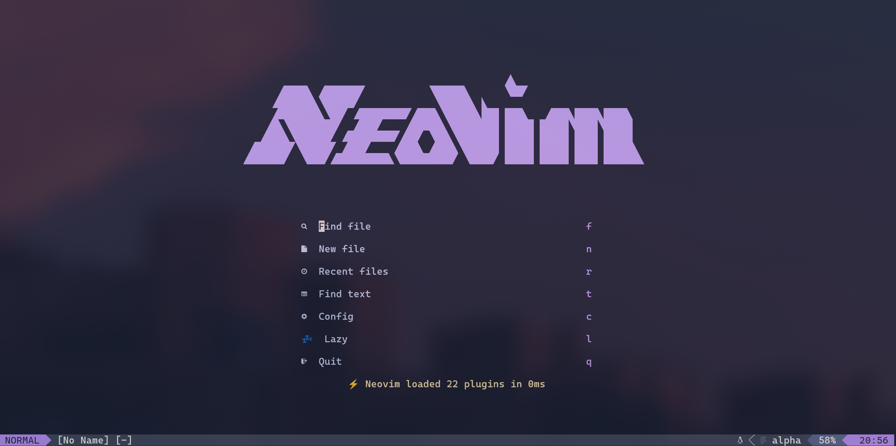
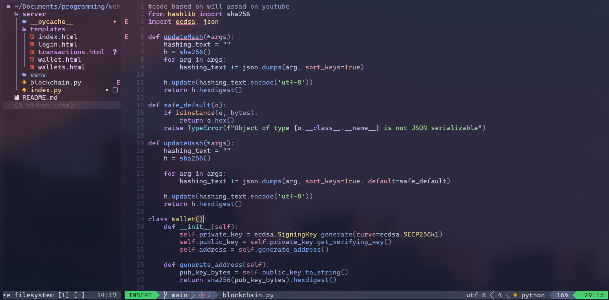

# Neovim Configuration

A modern Neovim configuration for Windows with LSP, autocompletion, file navigation, and more.

## Screenshots

### Dashboard


### File Explorer & Editor


## Features

- 🎨 **Catppuccin Mocha** color scheme
- 📝 **LSP Support** for multiple languages (Lua, TypeScript, C/C++, Python, Dart, CSS, HTML)
- ✨ **Auto-completion** with nvim-cmp and LuaSnip
- 🔍 **Telescope** fuzzy finder for files, text, and more
- 🌳 **Neo-tree** file explorer
- 💅 **Formatting & Linting** with none-ls (null-ls)
- 🚀 **Fast startup** with lazy-loading via lazy.nvim
- ⚡ **Treesitter** for better syntax highlighting

## Prerequisites

### Required
- **Neovim** >= 0.11.5
- **Git**
- **Node.js** and **npm** (for LSP servers)
- **Python 3** (for Python LSP and formatters)

### Recommended
- **ripgrep** (`rg`) - for Telescope live grep
- **fd** - for better file finding in Telescope
- **A Nerd Font** - for icons (e.g., JetBrains Mono Nerd Font, Cascadia Code PL)

### Install Tools via Chocolatey (Windows)

```powershell
# Install Neovim
choco install neovim -y

# Install required tools
choco install git nodejs python ripgrep fd -y

# Install a Nerd Font (optional but recommended for icons)
choco install nerd-fonts-jetbrainsmono -y
```

## Installation

1. **Backup existing config** (if any):
   ```powershell
   Move-Item $env:LOCALAPPDATA\nvim $env:LOCALAPPDATA\nvim.backup
   ```

2. **Clone this repository**:
   ```powershell
   git clone https://github.com/AlanMet/nvim-config.git $env:LOCALAPPDATA\nvim
   ```

3. **Start Neovim**:
   ```powershell
   nvim
   ```
   
   Lazy.nvim will automatically install all plugins on first launch.

4. **Install LSP servers**:
   - Open Neovim
   - Run `:Mason` to open Mason UI
   - Press `i` on any server to install it, or wait for auto-install

## Key Mappings

### General
| Key | Action |
|-----|--------|
| `<Space>` | Leader key |
| `<C-n>` | Toggle Neo-tree file explorer |
| `<leader>h` | Clear search highlights |
| `<leader>t` | Open terminal below |

### Navigation
| Key | Action |
|-----|--------|
| `<C-k>` | Move to window above |
| `<C-j>` | Move to window below |
| `<C-h>` | Move to window left |
| `<C-l>` | Move to window right |

### Telescope
| Key | Action |
|-----|--------|
| `<C-p>` | Find files |
| `<leader>fg` | Live grep (search text) |
| `<leader><leader>` | Recent files |
| `<leader>?` | Show keymaps |
| `<leader>op` | Open folder/project |
| `<leader>bf` | Show buffers (floating) |

### LSP
| Key | Action |
|-----|--------|
| `K` | Hover documentation |
| `gd` | Go to definition |
| `<leader>ca` | Code actions |
| `<leader>gf` | Format buffer |

### Completion
| Key | Action |
|-----|--------|
| `<C-Space>` | Trigger completion |
| `<CR>` | Confirm selection |
| `<C-e>` | Abort completion |
| `<C-b>` | Scroll docs up |
| `<C-f>` | Scroll docs down |

## Plugin List

- **lazy.nvim** - Plugin manager
- **catppuccin/nvim** - Color scheme
- **alpha-nvim** - Dashboard
- **lualine.nvim** - Status line
- **nvim-treesitter** - Better syntax highlighting
- **telescope.nvim** - Fuzzy finder
- **neo-tree.nvim** - File explorer
- **nvim-lspconfig** - LSP configuration
- **mason.nvim** - LSP/tool installer
- **nvim-cmp** - Autocompletion
- **LuaSnip** - Snippet engine
- **none-ls.nvim** - Formatting and linting
- **nvim-autopairs** - Auto-close brackets
- **nvim-web-devicons** - File icons

## Configuration Structure

```
~\AppData\Local\nvim\
├── init.lua              # Entry point
├── lua\
│   ├── vim-options.lua   # Vim settings and keymaps
│   └── plugins\          # Plugin configurations
│       ├── alpha.lua
│       ├── autopairs.lua
│       ├── catppuccin.lua
│       ├── completions.lua
│       ├── lsp-config.lua
│       ├── lualine.lua
│       ├── neo-tree.lua
│       ├── none-ls.lua
│       ├── telescope.lua
│       └── treesitter.lua
└── lazy-lock.json        # Plugin versions lock file
```

## Customization

### Change Color Scheme
Edit `lua/plugins/catppuccin.lua` and change the flavor:
```lua
vim.cmd.colorscheme "catppuccin-latte"  -- or macchiato, frappe, mocha
```

### Add LSP Servers
Edit `lua/plugins/lsp-config.lua` and add to the `servers` list:
```lua
local servers = {
  "lua_ls",
  "ts_ls",
  "rust_analyzer",  -- Add your server here
}
```

### Configure Formatters
Edit `lua/plugins/none-ls.lua` to add/remove formatters:
```lua
sources = {
  null_ls.builtins.formatting.stylua,
  null_ls.builtins.formatting.prettier,
  -- Add more here
}
```

## Troubleshooting

### Icons not showing
1. Install a Nerd Font
2. Set it in your terminal (Windows Terminal → Settings → Profiles → Appearance → Font face)
3. Restart terminal

### LSP not working
1. Check `:checkhealth vim.lsp`
2. Run `:Mason` and verify servers are installed
3. Restart Neovim

### Slow startup
1. Run `:Lazy profile` to see plugin load times
2. Consider lazy-loading more plugins with `event` or `cmd` options

## Updates

Update plugins:
```vim
:Lazy update
```

Update LSP servers and tools:
```vim
:Mason
```
Then press `U` to update all.

## License

MIT

## Credits

- Configuration inspired by the Neovim community
- Plugins by their respective authors
